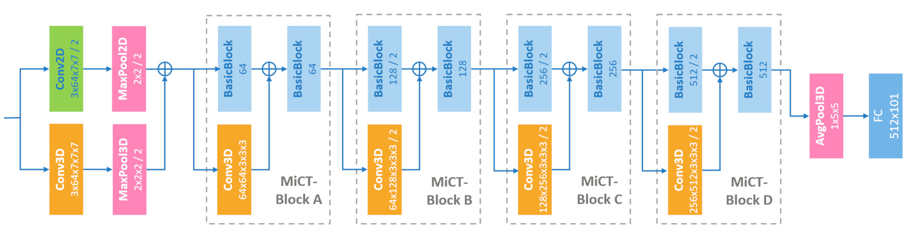
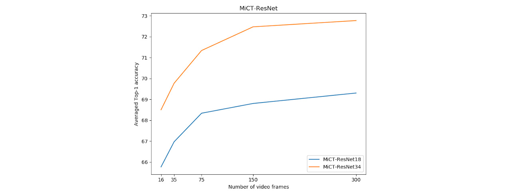

# MiCT-Net for Video Recognition

This is an implementation of the Mixed Convolutional Tube (MiCT) on PyTorch with a ResNet backbone. The model predicts the human action in each video from the UCF-101 dataset classification task. It achieves **69.3 top-1 cross-validated accuracy** with a ResNet-18 backbone and **72.8 top-1 cross-validated accuracy** with ResNet-34. This repository is based on the work by Y. Zhou, X. Sun, Z-J Zha and W. Zeng described in this [paper](https://www.microsoft.com/en-us/research/uploads/prod/2018/05/Zhou_MiCT_Mixed_3D2D_CVPR_2018_paper.pdf) from Microsoft Research.

**UPDATE:** You can find further information about this project in this [medium story](https://towardsdatascience.com/mict-net-for-human-action-recognition-in-videos-3a18e4f97342).

This repository includes:

* Source code of MiCT-Net built on the ResNet backbone, and named MiCT-ResNet throughout the rest of this repository

* Source code for 3D-ResNet adapted from [Kensho Hara](https://github.com/kenshohara/3D-ResNets-PyTorch) and used for performance comparison

* Code to prepare the UCF-101 dataset

* Training and evaluation code for UCF-101

* Pre-trained weights for MiCT-ResNet-18 and MiCT-ResNet-34

The code is documented and designed to be easy to extend for your own dataset. If you use it in your projects, please consider citing this repository (bibtex below).


## MiCT-ResNet Architecture Overview
This implementation follows the principle of MiCT-Net by introducing a small number of 3D residual convolutions at key locations of a 2D-CNN backbone. The authors observed that 3D ConvNets are limited in depth due their memory requirements and are difficult to train. Their idea is to limit the number of 3D convolution layers while increasing the depth of the feature map using a 2D-CNN.

There are many differences with the paper since the backbones are not the same. The paper uses a custom backbone inspired from Inception. This implementation uses the ResNet backbone instead to be able to more easily compare the obtained results and to benefit from pre-trained weights on ImageNet.
 


As shown above, the architecture uses five 3D convolutions, one at the entrance of the network and one at the beginning of each of the four main ResNet blocks. After each 3D convolution, features of the two branches are merged with a cross domain element-wise summation. This operation can speed up learning and allow training of deeper architectures. It also allows the 3D convolution branch to only learn residual temporal features, which are the motion of objects and persons in videos, to complement the spatial features learned by 2D convolutions.


## UCF-101 Dataset

[UCF-101](https://www.crcv.ucf.edu/data/UCF101.php) is an action recognition data set of realistic action videos, collected from YouTube, having 101 action categories. It has served the Computer Vision community well for many years and continues to be used for Deep Learning. All videos are 320x240 in size at 25 frames per second. Example frames of some of the human actions in UCF-101 are shown below.


## Implementation Details

To facilitate results comparison and unless otherwise stated, the procedure described below applies to both MiCT-ResNet and 3D-ResNet. 

* **Backbone:** Most experiments are based on the 18 layers version of the ResNet backbone. The temporal stride is 16 and the spatial stride is 32. The first 3D convolution has a temporal stride of 1 to fully harvest the input sequence. Weights are initialised from ImageNet pre-trained weights. For 3D-ResNet, the 3D filters are bootstrapped by repeating the weights of the 2D filters N times along the temporal dimension, and rescaling them by dividing by N. 

* **Optimizer and Regularization:** SGD is used with a learning rate of 1e-2 and a weight decay of 5e-4. These parameters have been selected using grid search. The training of Mict-ResNet-18 lasts 120 epochs with the learning rate divided by 10 after 80 epochs. The training of 3D-ResNet-18 lasts 90 epochs with the learning rate divided by 10 after 40 and 80 epochs. The batch size is set to 112 video clips of 16 frames each. 50% dropout is applied before the output layer.

* **Data Augmentation:** The literature indicates that UCF-101 does not have enough data and variation to avoid over-fitting on models with 3D convolutions. MiCT-ResNet is no exception. The problem can be resolved by pre-training the networks on Kinetics or any other large scale data set (out of the scope of this repository). I have used the full arsenal of augmentation techniques to reduce over-fitting as much as possible with temporal down-sampling, horizontal flipping, corner/center cropping at different random sizes and aspect ratios (more on this in the next bullet point), plus a combination of random brightness, contrast, and color adjustments. All frames of the same clip are applied identical transformations.

* **Video Preparation:** During training, each video is randomly down-sampled along the temporal dimension and a set of 16 consecutive frames is randomly chosen. The sequence is looped as necessary to obtain 16 frames clip. To support training with a large number of video clips per batch, the model's input size is set to 160x160. All frames are first re-sized to 256x192. The width and height are then independently picked from [128, 144, 160, 176, 192] and a region is cropped either at one of the corners of the image or at its center. The crop is then re-sized to 160x160. The aspect ratio thus randomly varies from 2/3 to 3/2. At test time, the first 16 frames of the video are selected, then resized to 256x192 and a center crop of 160x160 is extracted for all frames.

* **Hardware:** All experiments were done on a single Titan RTX with 24GB of RAM. For smaller configurations, consider reducing the input frames to 112x112 and/or applying a temporal stride of 2 on the first 3D convolution.


## Results

This section reports test results for the following experiments:
 * MiCT-ResNet-18 versus 3D-ResNet-18 trained and tested on 16 frames clip with a temporal stride of 16
 * MiCT-ResNet-18 with varying kernel sizes for the first 3D convolution: 3x7x7, 5x7x7, and 7x7x7
 * MiCT-ResNet-18 and Mict-ResNet-34 trained on 16 frames clip with a temporal stride of 4, and tested on varying sequences length 
 
The models are evaluated against the **top1** and **top5** accuracies. All results are averaged across the 3 standard splits. **MiCT-ResNet-18 leads by 1.5 point while being 3.1 times faster** which confirms the validity of the approach of the authors. The memory size is given for the processing of one video clip of 16 frames at a time (ie. batch size of one).

| Architecture                                            | Parameters  | Top1 / Top5     | Memory size |     FPS     |
|---------------------------------------------------------|-------------|-----------------|-------------|-------------|
| [MiCT-ResNet-18](results/MiCT-ResNet-18-7x7x7.jpg)      | 16.1M       | **63.3** / 83.8 | 985 MB      | **1981**    |
| [3D-ResNet-18](results/3D-ResNet-18.jpg)                | 33.3M       | 61.8 / 83.3     | 1045 MB     | 644         |

As shown below, the size of the first 3D kernel has a significant impact on the efficiency of the MiCT-ResNet architecture. Harvesting 7 consecutive RGB input frames provides the best accuracy but impacts inference speed.

| First 3D kernel size    | Parameters  | Top1 / Top5     | Memory size |     FPS     |
|-------------------------|-------------|-----------------|-------------|-------------|
| 3x7x7                   | 16.01M      | 61.4 / 83.3     | 983 MB      | 2380        |
| 5x7x7                   | 16.03M      | 62.7 / 83.4     | 985 MB      | 2147        |
| 7x7x7                   | 16.05M      | **63.3** / 83.8 | 985 MB      | 1981        |

In the last experiment the temporal stride is reduced from 16 to 4. The best result of **69.3** for MiCT-ResNet-18 and **72.8** for MiCT-ResNet-34 are achieved for sequences of 300 frames. The only modified parameters are the batch size (96 and 80 respectively) and dropout (60% and 70% respectively).



It remains to be seen how MiCT-ResNet and 3D-ResNet architectures compare if they were both pre-trained on ImageNet & Kinetics. Let me know if you have access to the Kinetics data set and are willing to contribute!


## Training on Your Own
I'm providing pre-trained weights on the first split of UCF-101 to make it easier to start. The validation accuracies are provided for 16 frames (clip) and 300 frames (video).

| Architecture                                                                    | Parameters  | Clip / Video |
|---------------------------------------------------------------------------------|-------------|--------------|
| [MiCT-ResNet-18](https://1drv.ms/u/s!AvyZUg7UPo_CgdN0CZ9lbJsVihw-Lw?e=aWO657)   | 16.1M       | 67.1 / 69.6  |
| [MiCT-ResNet-34](https://1drv.ms/u/s!AvyZUg7UPo_CgdN1booEiNyzTweTQQ?e=dkfjXW)   | 26.2M       | 69.0 / **73.8**  |

You can train, evaluate and predict directly from the command line as such:

```
# Training a new MiCT-ResNet-18 model starting from pre-trained ImageNet weights
python train.py --model mictresnet --version v1 --backbone resnet18 --lr 1e-2 --weight-decay 5e-4
                --dropout 0.5 --batch-size 112 --base-size 192 --crop-size 160 --split 1 
                --checkname MiCTResNet_V1 --crop-vid 16 --epochs 120 --pretrained 
                --lr-scheduler step --lr-step 80
```

You can also evaluate the model with:
```
# Evaluate 3D-ResNet-18 model on UCF-101 split 1 test set
python test.py --model 3dresnet --test-batch-size 1 --base-size 192 --crop-size 160 
               --resume /path/to/your/checkpoint/tar --split 1 --crop-vid 16
```

You can also test the inference speed on your hardware using this command:
```
# Test the inference speed
python test_speed.py --model mictresnet --version v1 --backbone resnet18
```

To prepare the dataset once download is complete run:

```
# Extract all frames from all videos and create the train/test lists for the 3 splits.
python prepare_ucf101.py --download-dir /path/to/your/downloaded/tar
```


## Requirements
Python 3.7, Torch 1.3 or greater, and tqdm.


## Citation
Use this bibtex to cite this repository:
```
@misc{fmahoudeau_mict_net_2019,
  title={Mixed Convolutional Tube (MiCT) with ResNets for video classification in PyTorch},
  author={Florent Mahoudeau},
  year={2019},
  publisher={GitHub},
  journal={GitHub repository},
  howpublished={\url{https://github.com/fmahoudeau/MiCT-Net-PyTorch}},
}
